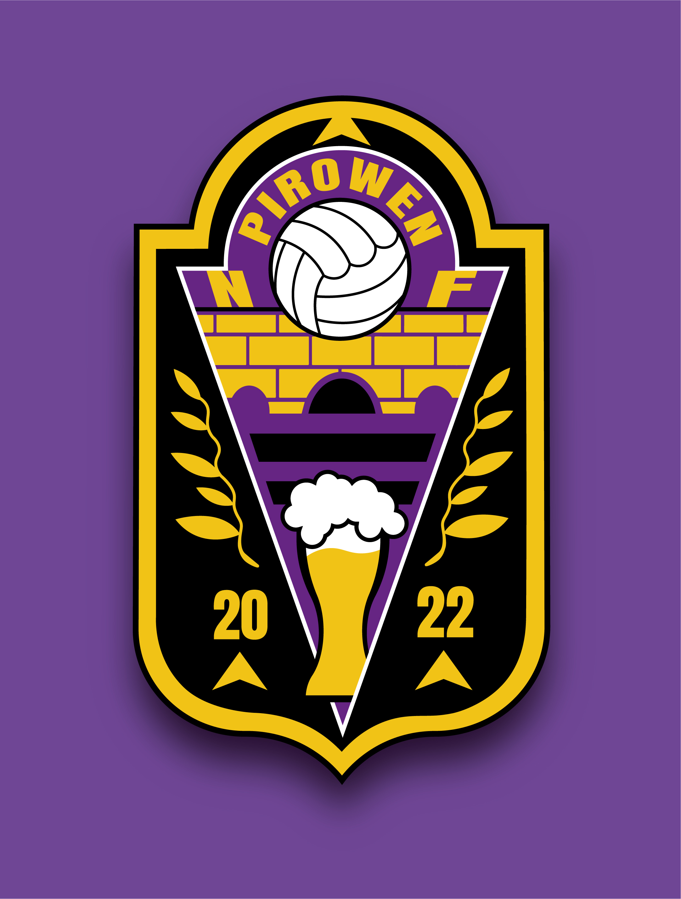

# NF Pirowen - Club de Fútbol

## Descripción

El Club de Fútbol NF Pirowen es una comunidad apasionada de jóvenes amantes del deporte, fundada en 2022 por un grupo de amigos. Actualmente, nuestro equipo es presidido por Manuel Pose. Somos un club acogedor ubicado en A Piroga, Galicia, donde disfrutamos del fútbol en familia, fusionando nuestra pasión por el deporte con nuestras raíces gallegas.

En NF Pirowen, nuestro lema "Go NF Go" nos impulsa a superar nuestros límites y alcanzar nuevas metas juntos. Creemos en el poder del trabajo en equipo y la camaradería, creando una comunidad unida que trasciende los límites de la cancha. Valoramos y apoyamos el crecimiento personal y deportivo de cada miembro, brindando un espacio enriquecedor para alcanzar el máximo potencial.

## Características

- **Pasión por el Fútbol:** Amamos el fútbol y disfrutamos cada momento en el campo.

- **Ambiente Acogedor:** Nuestro club ofrece un ambiente cálido y amigable para todos los miembros.

- **Identidad Gallega:** Celebramos nuestras raíces gallegas y fusionamos la pasión por el fútbol con nuestra herencia cultural.

- **Lema Inspirador:** "Go NF Go" es nuestra invitación a ir más allá y perseguir nuestras metas con determinación.

## Redes Sociales

Síguenos en nuestras redes sociales para mantenerte actualizado con las últimas novedades, eventos y fotos:

- [Instagram](https://www.instagram.com/nfpirowen)
- [YouTube](https://www.youtube.com/@NFPirowen/videos)

## Contribuciones

¡Agradecemos las contribuciones de la comunidad para mejorar el club! Si deseas colaborar, por favor, revisa nuestras pautas de contribución y envía tus pull requests.

## Contacto

Para cualquier consulta o información adicional, no dudes en contactarnos en [nfpirowen@gmail.com](mailto:nfpirowen@gmail.com).
